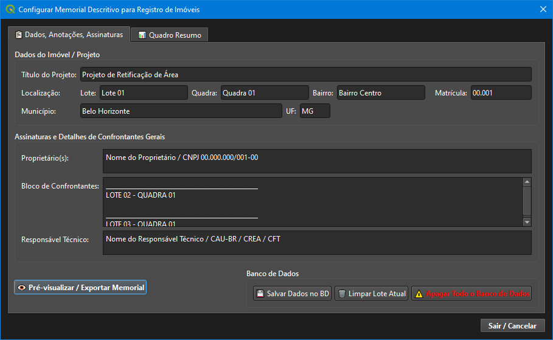
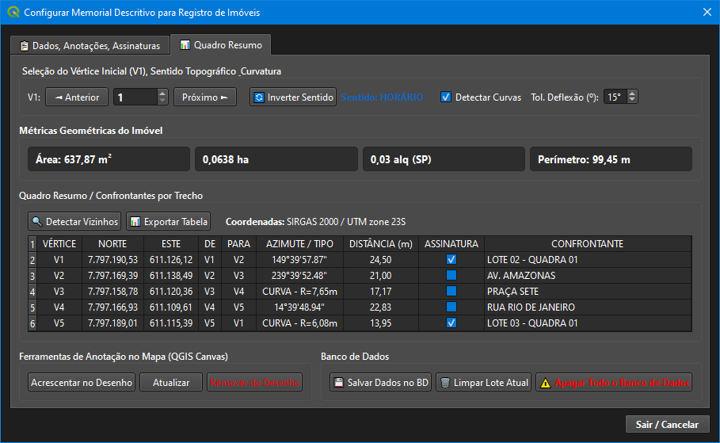
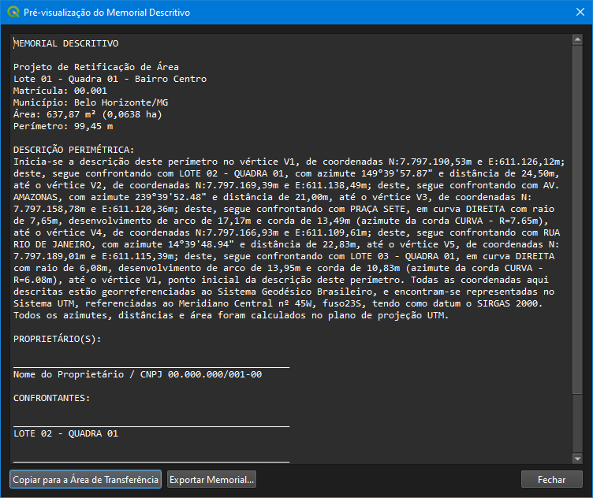
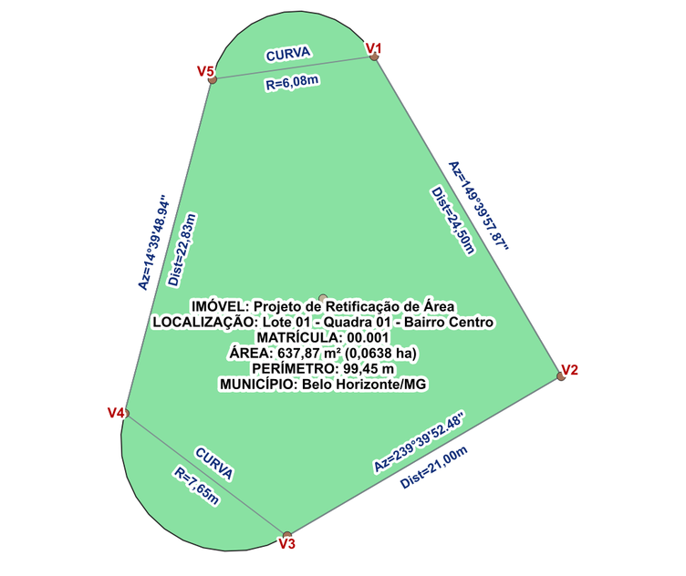

# Plugin Gerador de Memorial Descritivo para QGIS


Solução profissional desenvolvida para o **QGIS** focada no processamento topográfico de geometrias vetoriais, ordenação perimetral dinâmica (definição do V1 e inversão de sentido com destaque no mapa), detecção avançada de curvas com cálculo de elementos geométricos, métricas de área/perímetro, geração automatizada de anotações no Canvas e exportação de memoriais e tabelas padronizados para Registro de Imóveis.

---

## 📸 Demonstração das Interfaces e Resultados

A ferramenta possui uma interface organizada em abas funcionais para separar as etapas do fluxo de trabalho:

### 1. Aba "Dados, Anotações, Assinaturas"
Interface dedicada para o preenchimento de metadados imobiliários/projetos (Título, Lote, Quadra, Matrícula, Município/UF), Proprietários, Bloco de Confrontantes e Responsável Técnico, além de conter o botão de geração e pré-visualização do memorial.



### 2. Aba "Quadro Resumo"
Aba técnica contendo a seleção interativa do Vértice Inicial (V1), Inversão de Sentido Topográfico (Horário/Anti-Horário), Detecção de Curvas, Métricas Geométricas (m², ha, alq SP, perímetro), Tabela do Quadro Resumo de Trechos/Confrontantes, Ferramentas de Anotação no Canvas e Controle de Banco de Dados.



### 3. Janela de Pré-visualização e Exportação
Janela independente para revisão e validação do texto narrativo do Memorial Descritivo em tempo real, com opções de cópia rápida para a área de transferência e exportação nos formatos TXT, DOC e HTML.



### 4. Anotações e Rótulos Automáticos no Mapa (QGIS Canvas)
Desenho automático no Canvas contendo vértices numerados (V1 a V5), cotas de azimute/distância alinhadas às divisas, marcação de raio em curvas e bloco resumo central do imóvel.



---

## 🌟 Recursos Principais

- **Interface Organizada em Abas:** Separação entre dados cadastrais/jurídicos (*Dados, Anotações, Assinaturas*) e ferramentas de análise topográfica (*Quadro Resumo*).
- **Navegação e Destaque Dinâmico do V1:** Controle numérico (`◄ Anterior` / `Próximo ►`) para reordenar o ponto de amarração inicial sem alterar a geometria original no QGIS, com destaque visual em tempo real no mapa via `QgsRubberBand`.
- **Inversão de Sentido Topográfico:** Alternância instantânea entre o percurso **HORÁRIO** e **ANTI-HORÁRIO** com recálculo imediato de azimutes e sequenciamento de vértices.
- **Detecção Avançada de Curvas:** Identificação e agrupamento inteligente de arcos/curvas perimetrais com cálculo automático de **Raio (R)**, **Desenvolvimento de Arco (D)**, **Corda (C)** e **Azimute da Corda**.
- **Métricas Geométricas Automáticas:** Cálculo dinâmico em M² ($m^2$), Hectares ($ha$), Alqueire SP ($alq SP$) e Perímetro linear ($m$).
- **Pesquisa de Vizinhos via Análise Espacial:** Botão `Detectar Vizinhos BD` que realiza a interseção espacial com outros lotes cadastrados no banco SQLite.
- **Gerenciamento Completo de Banco de Dados (SQLite):** Persistência local dos metadados do projeto vinculados ao ID único da feição (`feature_id`), com opções para salvar, limpar lote ativo ou reiniciar todo o banco.
- **Ferramentas de Anotação no Canvas:** Criação e atualização de camadas temporárias no QGIS contendo marcadores de vértices, rótulos de azimute/distância orientados e bloco de dados central.
- **Tabela de Quadro Resumo Otimizada:** Linhas compactas com destaque interativo do trecho no mapa ao clicar sobre a linha da tabela.
- **Exportação Multi-formato:** Geração de arquivos `.TXT`, `.DOC`, `.HTML` e tabelas em `.CSV` ou `.XLSX`.

---

## 📋 Exemplo de Tabela Exportada (Quadro Resumo)

Abaixo está o exemplo dos dados gerados em formato estruturado (`CSV / XLSX`):

| VÉRTICE | COORDENADA NORTE | COORDENADA ESTE | DE | PARA | AZIMUTE / TIPO | DISTÂNCIA (m) | ASSINATURA | CONFRONTANTE |
| :---: | :---: | :---: | :---: | :---: | :---: | :---: | :---: | :--- |
| **V1** | 7.797.190,53 | 611.126,12 | V1 | V2 | 149°39'57.87" | 24,50 | [X] | LOTE 02 - QUADRA 01 |
| **V2** | 7.797.169,39 | 611.138,49 | V2 | V3 | 239°39'52.48" | 21,00 | [ ] | AV. AMAZONAS |
| **V3** | 7.797.158,78 | 611.120,36 | V3 | V4 | CURVA - R=7,65m | 17,17 | [ ] | PRAÇA SETE |
| **V4** | 7.797.166,93 | 611.109,61 | V4 | V5 | 14°39'48.94" | 22,83 | [ ] | RUA RIO DE JANEIRO |
| **V5** | 7.797.189,01 | 611.115,39 | V5 | V1 | CURVA - R=6,08m | 13,95 | [X] | LOTE 03 - QUADRA 01 |

---

## 📝 Exemplo de Memorial Descritivo Gerado

Exemplo de texto narrativo completo gerado pelo plugin para cartórios:

```text
MEMORIAL DESCRITIVO

Projeto de Retificação de Área
Lote 01 da Quadra 01 do Bairro Centro
Matrícula: 00.001
Município: Belo Horizonte/MG
Área: 637,87 m² (0,0638 ha)
Perímetro: 99,45 m

DESCRIÇÃO PERIMÉTRICA:
Inicia-se a descrição deste perímetro no vértice V1, de coordenadas N:7.797.190,53m e E:611.126,12m; deste, segue confrontando com LOTE 02 - QUADRA 01, com azimute 149º39'57.87" e distância de 24,50m, até o vértice V2, de coordenadas N:7.797.169,39m e E:611.138,49m; deste, segue confrontando com Área Confrontante, com azimute 239º39'52.48" e distância de 21,00m, até o vértice V3, de coordenadas N:7.797.158,78m e E:611.120,36m; deste, segue confrontando com Área Confrontante, em curva DIREITA com raio de 7,65m, desenvolvimento de arco de 17,17m e corda de 13,49m (azimute da corda CURVA - R=7.65m), até o vértice V4, de coordenadas N:7.797.166,93m e E:611.109,61m; deste, segue confrontando com Área Confrontante, com azimute 14º39'48.94" e distância de 22,83m, até o vértice V5, de coordenadas N:7.797.189,01m e E:611.115,39m; deste, segue confrontando com LOTE 03 - QUADRA 01, em curva DIREITA com raio de 6,08m, desenvolvimento de arco de 13,95m e corda de 10,83m (azimute da corda CURVA - R=6.08m), até o vértice V1, ponto inicial da descrição deste perímetro. Todas as coordenadas aqui descritas estão georreferenciadas ao Sistema Geodésico Brasileiro.

PROPRIETÁRIO(S):
________________________________________
Nome do Proprietário / CNPJ 00.000.000/001-00

CONFRONTANTES:
________________________________________
LOTE 02 - QUADRA 01

________________________________________
LOTE 03 - QUADRA 01
```

---

## 📁 Estrutura de Diretórios do Plugin

```text
memorial_descritivo/
├── __init__.py                      # Inicializador e fábrica de carregamento do plugin no QGIS
├── main.py                          # Gerenciador de interface (menus, ícones da toolbar e ações)
├── dialog.py                        # Ponto de integração do diálogo principal (compatibilidade/wrapper)
├── metadata.txt                     # Metadados do QGIS (nome, versão, autor, dependências e descrição)
├── README.md                        # Documentação técnica e guia do desenvolvedor/usuário
├── memorial_descritivo.svg          # Ícone vetorizado principal exibido na barra de ferramentas e menu
├── memorial_descritivo_help.svg     # Ícone vetorizado da ação de ajuda/documentação
├── memorial_dados.db                # Banco de dados SQLite local para persistência de metadados
├── core/                            # Núcleo do plugin com as regras de negócio e processamento
│   ├── __init__.py                  # Inicializador do pacote core
│   ├── annotator.py                 # Gerador de anotações e rótulos gráficos no QGIS Canvas
│   ├── database.py                  # Manipulação do banco SQLite (persistência de lotes e metadados)
│   ├── generator.py                 # Motor de geração de relatórios e exportação (TXT, DOC, HTML, CSV, XLSX)
│   ├── geometry.py                  # Cálculos topográficos (azimutes, distâncias, ordenação V1 e curvas)
│   └── models.py                    # Estrutura de dados e objetos de modelo (Vértices, Trechos, Imóvel)
├── ui/                              # Camada de interface gráfica do usuário (PyQt / QGIS UI)
│   ├── __init__.py                  # Inicializador do pacote UI
│   ├── memorial_dialog.py           # Janela principal do plugin (abas de dados, quadro resumo e eventos)
│   ├── preview_dialog.py            # Janela de pré-visualização interativa do memorial descritivo
│   └── widgets.py                   # Componentes visuais customizados e delegados de tabelas
├── utils/                           # Módulos de utilitários e funções auxiliares
│   ├── __init__.py                  # Inicializador do pacote utils
│   ├── compat.py                    # Camada de compatibilidade entre versões do QGIS (3.x e 4.x / PyQGIS API)
│   └── formatters.py                # Formatação de texto, valores numéricos, coordenadas e ângulos DMS
└── help/                            # Módulo de Ajuda Integrada em HTML
    ├── index.html                   # Documentação do usuário navegável integrada no QGIS
    ├── style.css                    # Folha de estilos para o manual HTML de ajuda
    ├── image_01.png                 # Captura de tela - Aba 1: Dados, Anotações, Assinaturas
    ├── image_02.png                 # Captura de tela - Aba 2: Quadro Resumo e Ferramentas
    ├── image_03.png                 # Captura de tela - Janela de Pré-visualização do Memorial
    └── image_04.png                 # Captura de tela - Anotações e Rótulos no Canvas do QGIS
```

---

## 💻 Requisitos do Sistema e Compatibilidade
- **QGIS:** Versão 3.22 LTS ou superior (compatível e preparado para QGIS 4.0).
- **Linguagem:** Python 3.9+.
- **Bibliotecas Adicionais:** `openpyxl` (opcional, para geração avançada de planilhas `.xlsx`).
- **Sistema de Referência de Coordenadas (SRC):** Recomendado o uso de camadas em coordenadas projetadas UTM (ex.: SIRGAS 2000 / UTM zone 23S - EPSG:31983).

---

## 📄 Licença

Este projeto está licenciado sob a Licença **MIT** - consulte o texto abaixo para obter detalhes:

MIT License

Copyright (c) 2026

Permission is hereby granted, free of charge, to any person obtaining a copy
of this software and associated documentation files (the "Software"), to deal
in the Software without restriction, including without limitation the rights
to use, copy, modify, merge, publish, distribute, sublicense, and/or sell
copies of the Software, and to permit persons to whom the Software is
furnished to do so, subject to the following conditions:

The above copyright notice and this permission notice shall be included in all
copies or substantial portions of the Software.

THE SOFTWARE IS PROVIDED "AS IS", WITHOUT WARRANTY OF ANY KIND, EXPRESS OR
IMPLIED, INCLUDING BUT NOT LIMITED TO THE WARRANTIES OF MERCHANTABILITY,
FITNESS FOR A PARTICULAR PURPOSE AND NONINFRINGEMENT. IN NO EVENT SHALL THE
AUTHORS OR COPYRIGHT HOLDERS BE LIABLE FOR ANY CLAIM, DAMAGES OR OTHER
LIABILITY, WHETHER IN AN ACTION OF CONTRACT, TORT OR OTHERWISE, ARISING FROM,
OUT OF OR IN CONNECTION WITH THE SOFTWARE OR THE USE OR OTHER DEALINGS IN THE
SOFTWARE.
